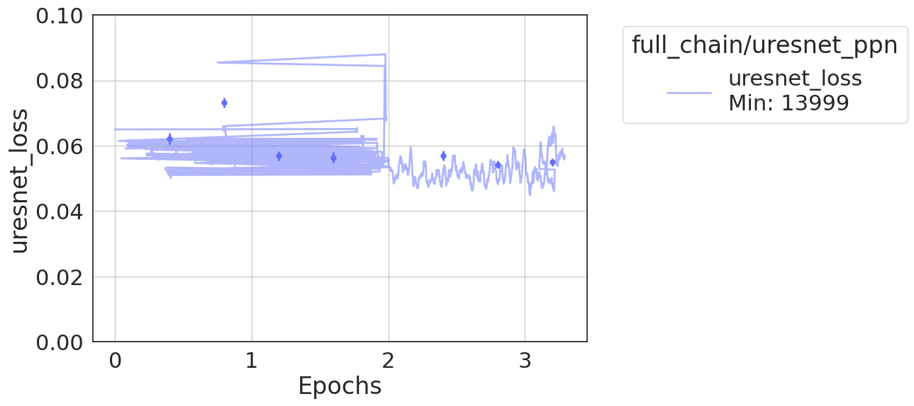
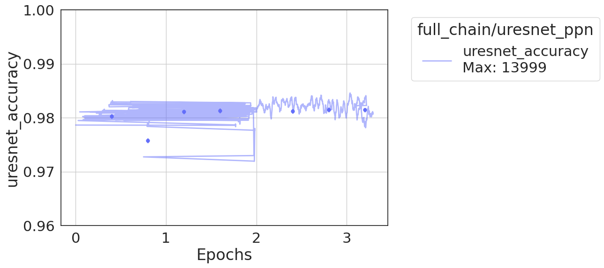
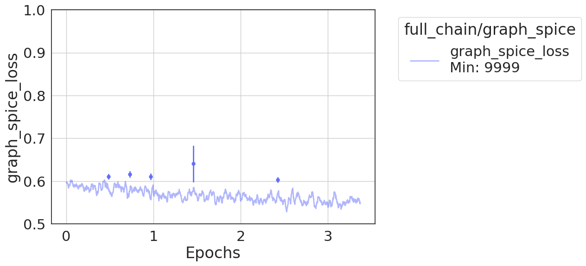
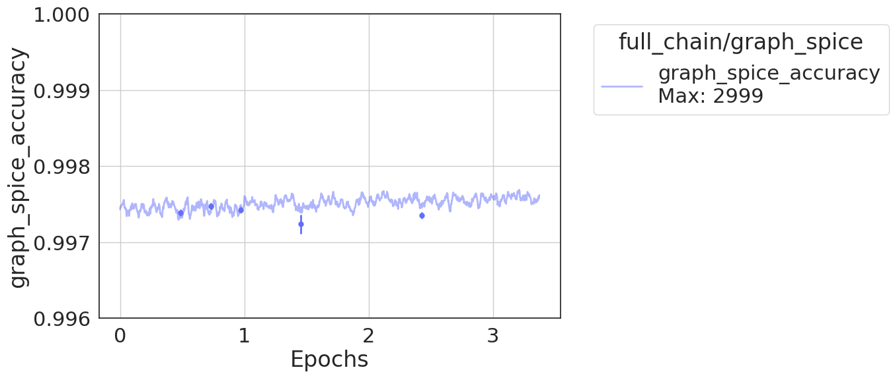
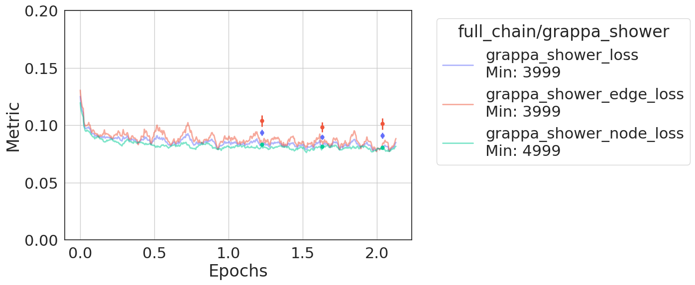
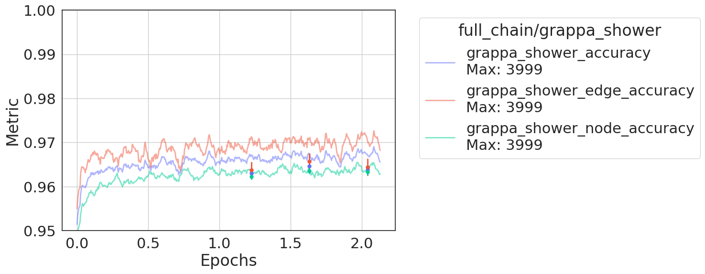
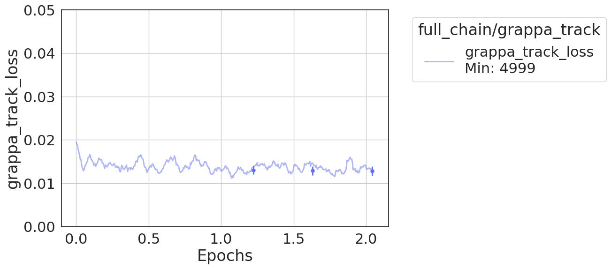
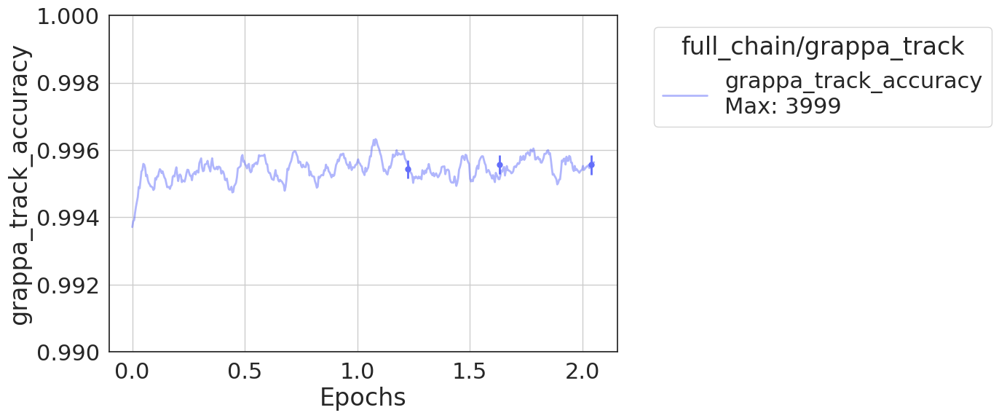
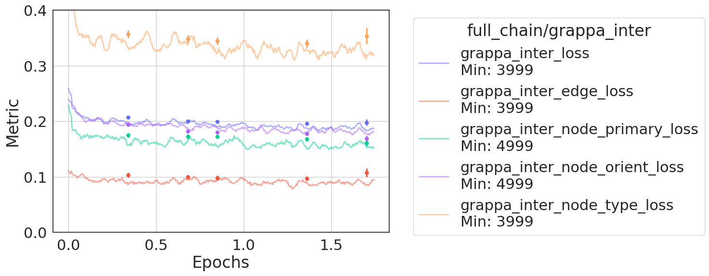
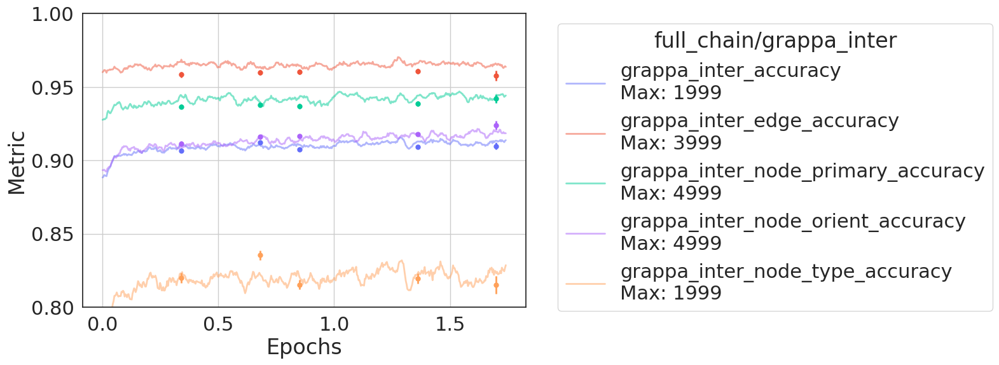

# SBND SPINE Train (Polaris)

This repository contains the code for training the SBND SPINE model on Polaris.

## Preparing

### Hadding

Files should be hadded together, such that they are each 50 GB, this is optimial for loading and batching. Additionally, the files should be split into test/train folders. An example file structure is:

```
test/larcv_mpvmpr_0000.root
test/larcv_mpvmpr_0001.root
test/larcv_mpvmpr_0002.root
...

train/larcv_mpvmpr_0000.root
train/larcv_mpvmpr_0001.root
train/larcv_mpvmpr_0002.root
...

```

### "skip_files_list:"

Some files have a very large number of ghost points which causes CNN trainings to fail. We observe that events in the highest percentile can be removed without impacting performance. To find these events, you first must count the number of voxels in each event. This is done using `test_batchsize_deghost.py`, where you provide a file list. Then you can make a histogram to find the number of events and set a cutoff maximum voxel size in `make_test_plot.py`. This should result in a file that you pass to the `skip_entry_list` parameter under `io: loader: dataset`.

### Debug
To run the training script locally do `. debug.sh`. This will start an interactive job with 1 node, 4GPUs, 64 cores, and up to 1 hour walltime. You can launch a training script by sourcing any of the `.sh` files in the directories. For example, UResNet PPN training can be launched by sourcing `spine_train/uresnet_ppn/train_uresnet_ppn.sh`. You can monitor the job by running the `monitor.sh` script in the same directory. You have to ssh into the node that the job is running on to monitor the job.

[sbnd_parl](https://github.com/SBN-ALCF/sbnd_parsl/tree/main) is used to parse the `mon_log.json` file to produce a summary of the resource usage. See [plot_spine_node_log.py](https://github.com/SBN-ALCF/sbnd_parsl/blob/main/tools/plot_spine_node_log.py) for more details.

### Submit job
Submit a job by doing `qsub <script_name>_qsub.sh`. For example, to submit the UResNet PPN training job, do `qsub spine_train/uresnet_ppn/train_uresnet_ppn_qsub.sh`. Once training is done, you can submit the validation script by doing `qsub spine_train/uresnet_ppn/val_uresnet_ppn_qsub.sh`.

### Full chain
Full chain transfer trains using labels from the previous stage. So you must select the previous stage's validation results to select the best set of weights for the model.

Once this is done, replace the weights in each `.cfg` file in the `full_chain` directory with the new weights. Transfer training happens in order: `graph_spice`, `uresnet_ppn`, [`grappa_shower`, `grappa_track`], and `grappa_inter`.

#### v02 Example results

Deghosting:


UResNet Sem.:






UResNet PPN:


Graph SPICE:






Grappa Shower:






Grappa Track:






Grappa Inter:





